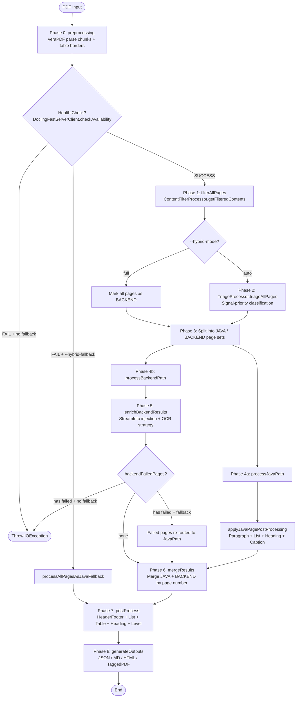
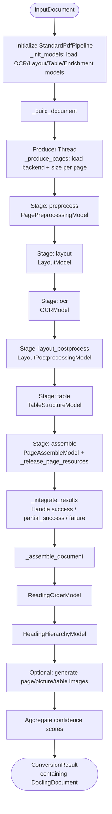
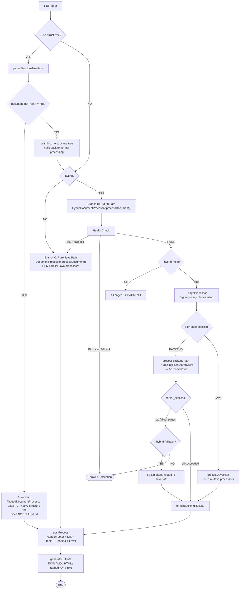

# Open Data Loader (ODL) & Docling Workflow Deep-Dive Report

> **Source Constraint**: All code references in this report are from the `main` branch of the following two repositories:
> - ODL: `https://github.com/opendataloader-project/opendataloader-pdf`
> - Docling: `https://github.com/docling-project/docling`

---

## Q1: Branch A — "Tagged PDF / Built-in Structure Tree" Explained

### 1.1 What is a Tagged PDF (Built-in Structure Tree)

A Tagged PDF embeds a **StructTreeRoot** (structure tree root) inside the PDF. This tree hierarchically describes the logical document structure, e.g.:
- `<Document>` --> `<Part>` --> `<Sect>` --> `<P>` (paragraph), `<Table>` (table), `<Figure>` (image), etc.
- Each structural element is linked to content-stream text/graphics operators via an **MCID (Marked Content ID)**.

When ODL detects a Tagged PDF, it directly leverages the PDF's native structure tree to extract reading order and element hierarchy, **skipping all AI/ML layout recognition** and **never calling the Hybrid backend**.

### 1.2 How ODL Detects a Tagged PDF

The detection logic lives in `DocumentProcessor.preprocessing()`:

```java
// Source: java/opendataloader-pdf-core/src/main/java/org/opendataloader/pdf/processors/DocumentProcessor.java
if (config.isUseStructTree()) {   // <-- controlled by CLI flag --use-struct-tree
    document.parseStructureTreeRoot();
    if (document.getTree() != null) {
        StaticLayoutContainers.setIsUseStructTree(true);
    } else {
        StaticLayoutContainers.setIsUseStructTree(false);
        LOGGER.log(Level.WARNING,
            "The document has no structure tree. "
            + "The 'use-struct-tree' option will be ignored.");
    }
}
```

**Detection flow**:
1. The user must explicitly pass `--use-struct-tree` on the CLI (`Config.isUseStructTree() == true`).
2. veraPDF's `GFSAPDFDocument.parseStructureTreeRoot()` attempts to read `/StructTreeRoot` from the PDF Catalog.
3. If `document.getTree() != null`, the tree exists; the Tagged path is activated.
4. If no tree exists, processing falls back to normal mode with a warning.

**Key caveat**: Even if a PDF physically contains a structure tree, ODL will **not** use it unless `--use-struct-tree` is passed. Without that flag, the document goes through the Hybrid or pure-Java path instead.

---

## 2. ODL Hybrid Mode — Complete Workflow

### 2.1 Top-Level Entry & Branch Decision

```java
// Source: java/opendataloader-pdf-core/src/main/java/org/opendataloader/pdf/processors/DocumentProcessor.java
public static ExtractionResult extractContents(String inputPdfName, Config config) {
    preprocessing(inputPdfName, config);
    Set<Integer> pagesToProcess = getValidPageNumbers(config);
    List<List<IObject>> contents;

    if (StaticLayoutContainers.isUseStructTree()) {
        // Branch A: Tagged PDF path
        if (config.isHybridEnabled()) {
            LOGGER.log(Level.WARNING,
                "Both --use-struct-tree and --hybrid were set... "
                + "The structure tree takes precedence, "
                + "so the hybrid backend was NOT called.");
        }
        contents = TaggedDocumentProcessor.processDocument(...);
    } else if (config.isHybridEnabled()) {
        // Branch B: Hybrid path (focus of this report)
        contents = HybridDocumentProcessor.processDocument(...);
    } else {
        // Branch C: Pure Java path
        contents = processDocument(inputPdfName, config, pagesToProcess);
    }
    // ...
}
```

### 2.2 Hybrid Mode Workflow Diagram



### 2.3 Phase-by-Phase Input / Output & Code References

#### Phase 0: Preprocessing
| Item | Detail |
|------|--------|
| **Input** | PDF file path (`String inputPdfName`), `Config config` |
| **Output** | veraPDF `StaticContainers` initialized, `PDDocument` loaded, chunks parsed, TableBorders pre-detected |
| **Code source** | `DocumentProcessor.preprocessing()` |
| **Hardcoded** | `validatePdfMagicNumber()` scans first 1024 bytes for `%PDF-` magic number |

#### Phase 1: Filter All Pages
| Item | Detail |
|------|--------|
| **Input** | `inputPdfName`, `config`, `pagesToProcess`, `totalPages` |
| **Output** | `Map<Integer, List<IObject>> filteredContents`<br/>Per-page raw elements: TextChunk, ImageChunk, LineChunk, LineArtChunk |
| **Code source** | `HybridDocumentProcessor.filterAllPages()` --> `ContentFilterProcessor.getFilteredContents()` |
| **Hardcoded** | Filter rules driven by `config.getFilterConfig()`, but implementation logic lives inside `ContentFilterProcessor` |

#### Phase 2: Triage (Core Routing)
| Item | Detail |
|------|--------|
| **Input** | `filteredContents`, `HybridConfig` |
| **Output** | `Map<Integer, TriageResult>`; each `TriageResult` contains `decision` (JAVA/BACKEND), `confidence`, `signals` |
| **Code source** | `TriageProcessor.triageAllPages()` --> `classifyPage()` |
| **Hardcoded** | Signal priority order and all threshold constants (see table below) |

**Triage Signal Thresholds (All Hardcoded)**:

| Constant Name | Value | Meaning | Code File |
|---------------|-------|---------|-----------|
| `DEFAULT_LINE_RATIO_THRESHOLD` | `0.3` | LineChunk / total-content ratio threshold | `TriageProcessor.java` |
| `DEFAULT_ALIGNED_LINE_GROUPS_THRESHOLD` | `5` | Min aligned line groups to trigger BACKEND | `TriageProcessor.java` |
| `DEFAULT_GRID_GAP_MULTIPLIER` | `3.0` | Grid-gap detection multiplier | `TriageProcessor.java` |
| `BASELINE_EPSILON` | `0.1` | Baseline coordinate tolerance | `TriageProcessor.java` |
| `MIN_LINE_COUNT_FOR_TABLE` | `8` | Min line segments suggesting table borders | `TriageProcessor.java` |
| `MIN_GRID_LINES` | `3` | Min horizontal + vertical line pairs for grid | `TriageProcessor.java` |
| `MIN_ROW_SEPARATOR_PATTERN` | `5` | Min line-text-line alternations for row separators | `TriageProcessor.java` |
| `MIN_LINE_ART_FOR_TABLE` | `8` | Min LineArt chunks indicating table structure | `TriageProcessor.java` |
| `LINE_LENGTH_TOLERANCE` | `0.05` (5%) | Tolerance for matching aligned short line lengths | `TriageProcessor.java` |
| `MIN_ALIGNED_SHORT_LINES` | `2` | Min aligned short lines with same X and length | `TriageProcessor.java` |
| `MIN_CONSECUTIVE_PATTERNS` | `2` | Min consecutive suspicious patterns required | `TriageProcessor.java` |
| `MIN_LARGE_IMAGE_RATIO` | `0.11` | Min image area ratio (11% of page) | `TriageProcessor.java` |
| `MIN_IMAGE_ASPECT_RATIO` | `1.75` | Min image aspect ratio (width/height) | `TriageProcessor.java` |
| `HIGH_PATTERN_COUNT_THRESHOLD` | `30` | High pattern count threshold (skip consecutive check) | `TriageProcessor.java` |
| `MIN_TABLE_PATTERNS` | `3` | Min absolute patterns required | `TriageProcessor.java` |
| `MIN_PATTERN_DENSITY` | `0.10` | Min pattern density (patterns / text chunks) | `TriageProcessor.java` |
| `MULTI_COLUMN_X_SHIFT_RATIO` | `2.0` | X-shift ratio to detect column change | `TriageProcessor.java` |
| `X_DIFFERENCE_EPSILON` | `1.5` | X-difference epsilon for gap detection | `TriageProcessor.java` |

**Signal Priority (Hardcoded Order, Not Configurable)**:

```java
// Source: TriageProcessor.java
1. CID font extraction failure (replacement char ratio >= 0.3)  --> BACKEND, confidence=1.0
2. TableBorder presence                                          --> BACKEND, confidence=1.0
3. Vector graphics table signal (grid/borders/line art)          --> BACKEND, confidence=0.95
4. Text-based table patterns (consecutive validation)            --> BACKEND, confidence=0.9
5. Large image detection                                         --> BACKEND, confidence=0.85
6. High LineChunk ratio (> 0.3)                                  --> BACKEND, confidence=0.8
7. (Disabled) Suspicious text patterns
8. (Disabled) Grid pattern detection (aligned baselines with gaps)
Default                                                          --> JAVA,   confidence=0.9
```

#### Phase 3: Split Pages
| Item | Detail |
|------|--------|
| **Input** | `Map<Integer, TriageResult> triageResults` |
| **Output** | `Set<Integer> javaPages`, `Set<Integer> backendPages` |
| **Code source** | `HybridDocumentProcessor.filterByDecision()` |
| **Hardcoded** | Filters by `TriageDecision.JAVA` / `TriageDecision.BACKEND` enum values |

#### Phase 4a: Java Path
| Item | Detail |
|------|--------|
| **Input** | `filteredContents`, `javaPages`, `Config config`, `totalPages` |
| **Output** | `Map<Integer, List<IObject>> javaResults` |
| **Code source** | `HybridDocumentProcessor.processJavaPath()` |
| **Execution steps** | 1. `ClusterTableProcessor.processTables()` (document-level sequential)<br/>2. Per-page: `TextDecorationProcessor` --> `TableBorderProcessor` --> filter LineChunk --> `SpecialTableProcessor` --> `TextLineProcessor`<br/>3. Per-page post-processing: `ParagraphProcessor` --> `ListProcessor.processListsFromTextNodes()` --> `HeadingProcessor` --> `setIDs()` --> `CaptionProcessor` |

#### Phase 4b: Backend Path
| Item | Detail |
|------|--------|
| **Input** | `inputPdfName`, `backendPages`, `Config config`, `Set<Integer> backendFailedPages` (output parameter) |
| **Output** | `Map<Integer, List<IObject>> backendResults` |
| **Code source** | `HybridDocumentProcessor.processBackendPath()` |
| **Execution steps** | 1. `getClient(config)` retrieves cached HybridClient<br/>2. `fetchHealth()` snapshots backend environment metadata<br/>3. Read PDF bytes<br/>4. `determineOutputFormats(config)` --> **hardcoded to JSON only**<br/>5. Chunk by `BACKEND_CHUNK_SIZE = 50`<br/>6. Per chunk: build `HybridRequest` --> `client.convert(request)`<br/>7. Parse `HybridResponse`: extract `json_content`, `failed_pages`, `timings`<br/>8. `DoclingSchemaTransformer.transform()` converts JSON to IObject lists |

**Backend HTTP Request Format**:

```java
// Source: DoclingFastServerClient.java
MultipartBody.Builder bodyBuilder = new MultipartBody.Builder()
    .setType(MultipartBody.FORM)
    .addFormDataPart("files", "document.pdf",
        RequestBody.create(request.getPdfBytes(), MEDIA_TYPE_PDF));

// Optional page_ranges parameter
bodyBuilder.addFormDataPart("page_ranges", minPage + "-" + maxPage);

// POST {baseUrl}/v1/convert/file
```

**Backend Response Parsing**:

```java
// Source: DoclingFastServerClient.java
JsonNode statusNode = root.get("status");
String status = statusNode != null ? statusNode.asText() : "";

if ("failure".equals(status)) { throw new IOException(...); }
if ("partial_success".equals(status)) {
    // Extract failed_pages array
    List<Integer> failedPages = extractFailedPages(root);
}

JsonNode documentNode = root.get("document");
JsonNode jsonContent = documentNode.get("json_content");
JsonNode timingsNode = root.get("timings");
```

**DoclingSchemaTransformer Mapping**:

| Docling JSON Element | ODL IObject | Processing Logic |
|----------------------|-------------|------------------|
| `texts` (label=`text`) | `SemanticParagraph` | `createParagraph()` |
| `texts` (label=`section_header`) | `SemanticHeading` | `createHeading()`, extracts `meta.level` |
| `texts` (label=`formula`) | `SemanticFormula` | `createFormula()` |
| `texts` (label=`page_header`/`page_footer`) | Dropped | Furniture filter |
| `tables` | `TableBorder` | Extracts `data.grid` + `data.table_cells`, handles `row_span`/`col_span` |
| `pictures` | `SemanticPicture` | Extracts `annotations[kind="description"]` as alt text |
| `bbox` (TOPLEFT origin) | `BoundingBox` (BOTTOMLEFT) | `top = pageHeight - t; bottom = pageHeight - b` |

#### Phase 5: Enrichment (Backend Result Enhancement)
| Item | Detail |
|------|--------|
| **Input** | `backendResults`, `filteredContents`, `HybridConfig`, `pictureSwapOriginalIds` |
| **Output** | Enriched `backendResults` (IObjects with StreamInfo injected) |
| **Code source** | `HybridDocumentProcessor.enrichBackendResults()` |
| **Core logic** | 1. `SemanticPicture` --> `EnrichedImageChunk` (matches Java `ImageChunk` by bbox center point, keeps original PDF `/Alt` or AI caption)<br/>2. Replace `SemanticTextNode` TextChunks with Java TextChunks carrying StreamInfo (bbox center point, 5pt tolerance)<br/>3. Inject StreamInfo into `SemanticFormula`<br/>4. OCR strategy branch: `off` / `auto` / `force` |

**OCR Strategy Branch Code**:

```java
// Source: HybridDocumentProcessor.java + HybridConfig.java
public static final String OCR_OFF   = "off";    // stream only
public static final String OCR_AUTO  = "auto";   // stream first, OCR fallback
public static final String OCR_FORCE = "force";  // OCR only

// Auto-mode trust decision
if (!TextSimilarity.trustStream(streamText, ocrText, TextSimilarity.DEFAULT_THRESHOLD)) {
    recordTextSource(textNode, "ocr", sim);    // keep OCR
} else {
    recordTextSource(textNode, "stream", sim);  // replace with stream
}
```

#### Phase 6: Merge Results
| Item | Detail |
|------|--------|
| **Input** | `javaResults`, `backendResults`, `pagesToProcess`, `totalPages` |
| **Output** | `List<List<IObject>> contents` (complete content indexed by page) |
| **Code source** | `HybridDocumentProcessor.mergeResults()` |
| **Logic** | Loop by page number: prefer `javaResults`, then `backendResults`, else empty list |

#### Phase 7: Post-Processing
| Item | Detail |
|------|--------|
| **Input** | Merged `contents`, `config`, `pagesToProcess`, `totalPages` |
| **Output** | Cross-page-structured `contents` |
| **Code source** | `HybridDocumentProcessor.postProcess()` |
| **Execution steps** | 1. `HeaderFooterProcessor.processHeadersAndFooters(contents, false)`<br/>2. `ListProcessor.processListsFromTextNodes()` (per-page)<br/>3. `ListProcessor.checkNeighborLists(contents)` (cross-page)<br/>4. `TableBorderProcessor.checkNeighborTables(contents)` (cross-page)<br/>5. `HeadingProcessor.detectHeadingsLevels()` (cross-page)<br/>6. `LevelProcessor.detectLevels(contents)` (cross-page) |

#### Phase 8: Generate Outputs
| Item | Detail |
|------|--------|
| **Input** | `contents`, `config`, `elementMetadata` |
| **Output** | JSON / Markdown / HTML / Tagged PDF / Text files |
| **Code source** | `DocumentProcessor.generateOutputs()` |
| **Configurable** | `config.isGenerateJSON()`, `isGenerateMarkdown()`, `isGenerateHtml()`, `isGenerateTaggedPDF()`, `isGenerateText()` |

---

## 3. Pure Docling Workflow (StandardPdfPipeline)

### 3.1 Entry & Architecture

```python
# Source: docling/document_converter.py
class DocumentConverter:
    def convert(self, source):
        pipeline = self._get_pipeline(doc_format=format)  # StandardPdfPipeline
        conv_res = pipeline.execute(in_doc)
        return conv_res
```

### 3.2 Docling Pipeline Workflow Diagram



### 3.3 Stage-by-Stage Input / Output

#### Stage: preprocess
| Item | Detail |
|------|--------|
| **Input** | `List<Page>` (with `_backend` attached) |
| **Output** | Pre-processed `List<Page>` (image scale, backend validation) |
| **Code source** | `standard_pdf_pipeline.py` --> `PreprocessThreadedStage` |
| **Hardcoded** | `batch_size=1` |

#### Stage: layout
| Item | Detail |
|------|--------|
| **Input** | `List<Page>` |
| **Output** | `List<Page>` with layout predictions (labels: text, table, picture, section_header, etc.) |
| **Code source** | `standard_pdf_pipeline.py` --> `ThreadedPipelineStage(name="layout")` |
| **Configurable** | `layout_options`, `layout_batch_size` |

#### Stage: ocr
| Item | Detail |
|------|--------|
| **Input** | `List<Page>` |
| **Output** | `List<Page>` with OCR words injected |
| **Code source** | `standard_pdf_pipeline.py` --> `ThreadedPipelineStage(name="ocr")` |
| **Configurable** | `do_ocr`, `ocr_options`, `ocr_batch_size` |
| **Hardcoded** | Model is still initialized even if `do_ocr=false`, but runs with `enabled=false` |

#### Stage: layout_postprocess
| Item | Detail |
|------|--------|
| **Input** | `List<Page>` |
| **Output** | Post-processed layout clusters |
| **Code source** | `standard_pdf_pipeline.py` --> `ThreadedPipelineStage(name="layout_postprocess")` |
| **Configurable** | `skip_cell_assignment`, `keep_empty_clusters`, `create_orphan_clusters` |
| **Hardcoded** | `batch_size=1` |

#### Stage: table
| Item | Detail |
|------|--------|
| **Input** | `List<Page>` |
| **Output** | `List<Page>` with `TableItem` (containing `data.grid` and `data.table_cells`) |
| **Code source** | `standard_pdf_pipeline.py` --> `ThreadedPipelineStage(name="table")` |
| **Configurable** | `do_table_structure`, `table_structure_options`, `table_batch_size` |

#### Stage: assemble
| Item | Detail |
|------|--------|
| **Input** | `List<Page>` |
| **Output** | Assembled `AssembledUnit` (elements, headers, body) |
| **Code source** | `standard_pdf_pipeline.py` --> `ThreadedPipelineStage(name="assemble")` |
| **Hardcoded** | `batch_size=1`, with `_release_page_resources` cleanup attached |

#### _assemble_document (Document-Level Assembly)
| Item | Detail |
|------|--------|
| **Input** | `ConversionResult` (assembled data from all pages) |
| **Output** | Complete `DoclingDocument` |
| **Code source** | `StandardPdfPipeline._assemble_document()` |
| **Execution steps** | 1. Merge all page elements/headers/body<br/>2. `ReadingOrderModel` generates reading order<br/>3. `HeadingHierarchyModel` detects heading levels<br/>4. Optional image generation (page/picture/table)<br/>5. Aggregate confidence (`layout_score`, `parse_score`, `table_score`, `ocr_score`) |

#### _integrate_results (Result Integration)
| Item | Detail |
|------|--------|
| **Input** | `ConversionResult`, `ProcessingResult` |
| **Output** | Updated status (SUCCESS / PARTIAL_SUCCESS / FAILURE) and errors |
| **Code source** | `StandardPdfPipeline._integrate_results()` |
| **Hardcoded** | `parse_score` uses 10th percentile (`np.nanquantile(..., q=0.1)`) |

---

## 4. Configurable vs. Hardcoded (Source-Change Required)

### 4.1 ODL Configurable (CLI / API Tunable)

| Config Item | CLI Flag | Default | Code Location |
|-------------|----------|---------|-----------------|
| Enable Hybrid | `--hybrid {docling-fast,hancom,hancom-ai}` | none | `Config.isHybridEnabled()` |
| Hybrid URL | `--hybrid-url` | `http://localhost:5002` | `HybridConfig.getEffectiveUrl()` |
| Hybrid Timeout | `--hybrid-timeout` | `0` (unlimited) | `HybridConfig.getTimeoutMs()` |
| Hybrid Mode | `--hybrid-mode {auto,full}` | `auto` | `HybridConfig.getMode()` |
| Fallback | `--hybrid-fallback` | `false` | `HybridConfig.isFallbackToJava()` |
| OCR Strategy | `--ocr-strategy {off,auto,force}` | `auto` | `HybridConfig.getOcrStrategy()` |
| Regionlist Strategy | `--regionlist-strategy {table-first,list-only}` | `table-first` | `HybridConfig.getRegionlistStrategy()` |
| Save Crops | `--save-crops` | `false` | `HybridConfig.isSaveCrops()` |
| Use Struct Tree | `--use-struct-tree` | `false` | `Config.isUseStructTree()` |
| Output Formats | `--generate-json`, `--generate-md`, `--generate-html`, `--generate-tagged-pdf`, `--generate-text` | depends on CLI | `Config` `isGenerateXxx()` |
| Thread Count | `--threads` | available CPU cores | `Config.getThreads()` |
| Reading Order | `--reading-order {off,xycut}` | `off` | `Config.getReadingOrder()` |

### 4.2 ODL Hardcoded (Source Change Required)

| Constant / Logic | Value | Code File |
|------------------|-------|-----------|
| `BACKEND_CHUNK_SIZE` | `50` | `HybridDocumentProcessor.java` |
| `CONVERT_ENDPOINT` | `"/v1/convert/file"` | `DoclingFastServerClient.java` |
| `HEALTH_CHECK_TIMEOUT_MS` | `3000` | `DoclingFastServerClient.java` |
| `DEFAULT_FILENAME` | `"document.pdf"` | `DoclingFastServerClient.java` |
| `MEDIA_TYPE_PDF` | `application/pdf` | `DoclingFastServerClient.java` |
| Triage signal priority | Fixed order 0-->6 | `TriageProcessor.java` |
| `replacementRatio >= 0.3` | `0.3` | `TriageProcessor.java` |
| `DEFAULT_LINE_RATIO_THRESHOLD` | `0.3` | `TriageProcessor.java` |
| `DEFAULT_ALIGNED_LINE_GROUPS_THRESHOLD` | `5` | `TriageProcessor.java` |
| `DEFAULT_GRID_GAP_MULTIPLIER` | `3.0` | `TriageProcessor.java` |
| `BASELINE_EPSILON` | `0.1` | `TriageProcessor.java` |
| `MIN_LINE_COUNT_FOR_TABLE` | `8` | `TriageProcessor.java` |
| `MIN_GRID_LINES` | `3` | `TriageProcessor.java` |
| `MIN_ROW_SEPARATOR_PATTERN` | `5` | `TriageProcessor.java` |
| `MIN_LINE_ART_FOR_TABLE` | `8` | `TriageProcessor.java` |
| `LINE_LENGTH_TOLERANCE` | `0.05` | `TriageProcessor.java` |
| `MIN_ALIGNED_SHORT_LINES` | `2` | `TriageProcessor.java` |
| `MIN_CONSECUTIVE_PATTERNS` | `2` | `TriageProcessor.java` |
| `MIN_LARGE_IMAGE_RATIO` | `0.11` | `TriageProcessor.java` |
| `MIN_IMAGE_ASPECT_RATIO` | `1.75` | `TriageProcessor.java` |
| `HIGH_PATTERN_COUNT_THRESHOLD` | `30` | `TriageProcessor.java` |
| `MIN_TABLE_PATTERNS` | `3` | `TriageProcessor.java` |
| `MIN_PATTERN_DENSITY` | `0.10` | `TriageProcessor.java` |
| `MULTI_COLUMN_X_SHIFT_RATIO` | `2.0` | `TriageProcessor.java` |
| `X_DIFFERENCE_EPSILON` | `1.5` | `TriageProcessor.java` |
| `determineOutputFormats()` returns only JSON | hardcoded | `HybridDocumentProcessor.java` |
| Backend type whitelist | `docling-fast`, `hancom`, `hancom-ai` | `HybridClientFactory.java` |
| Enrichment bbox tolerance | `5.0` (text), `1.0` (image) | `HybridDocumentProcessor.java` |
| `TextSimilarity.DEFAULT_THRESHOLD` | not shown in full in snippets | `HybridDocumentProcessor.java` |

### 4.3 Docling Configurable (Python API)

| Config Item | Description | Code Location |
|-------------|-------------|---------------|
| `do_ocr` | Enable OCR | `PipelineOptions` |
| `ocr_options` | OCR engine, language | `PipelineOptions` |
| `do_table_structure` | Table structure recognition | `PipelineOptions` |
| `table_structure_options` | Table model config | `PipelineOptions` |
| `layout_options` | Layout model config | `PipelineOptions` |
| `do_code_enrichment` | Code enrichment | `PipelineOptions` |
| `do_formula_enrichment` | Formula enrichment | `PipelineOptions` |
| `do_picture_classification` | Picture classification | `PipelineOptions` |
| `do_picture_description` | Picture description | `PipelineOptions` |
| `do_chart_extraction` | Chart extraction | `PipelineOptions` |
| `generate_page_images` | Generate page images | `PipelineOptions` |
| `generate_picture_images` | Generate element images | `PipelineOptions` |
| `generate_table_images` | Generate table images | `PipelineOptions` |
| `images_scale` | Image scale | `PipelineOptions` |
| `document_timeout` | Document processing timeout | `ThreadedPdfPipelineOptions` |
| `ocr_batch_size` | OCR batch size | `ThreadedPdfPipelineOptions` |
| `layout_batch_size` | Layout batch size | `ThreadedPdfPipelineOptions` |
| `table_batch_size` | Table batch size | `ThreadedPdfPipelineOptions` |
| `queue_max_size` | Queue max size | `ThreadedPdfPipelineOptions` |
| `batch_polling_interval_seconds` | Batch polling interval | `ThreadedPdfPipelineOptions` |
| `accelerator_options` | CPU/GPU/MPS | `PipelineOptions` |

### 4.4 Docling Hardcoded (Source Change Required)

| Constant / Logic | Value / Behavior | Code File |
|------------------|------------------|-----------|
| Stage order | `preprocess-->layout-->ocr-->layout_postprocess-->table-->assemble` | `StandardPdfPipeline._create_run_ctx()` |
| `preprocess` batch_size | `1` | `StandardPdfPipeline._create_run_ctx()` |
| `layout_postprocess` batch_size | `1` | `StandardPdfPipeline._create_run_ctx()` |
| `assemble` batch_size | `1` | `StandardPdfPipeline._create_run_ctx()` |
| Stage thread join timeout | `15.0` seconds | `ThreadedPipelineStage.stop()` |
| Producer thread join timeout | `15.0` seconds | `StandardPdfPipeline._build_document()` |
| `parse_score` percentile | `q=0.1` (worst 10%) | `StandardPdfPipeline._assemble_document()` |
| `layout_score` aggregation | `np.nanmean` | `StandardPdfPipeline._assemble_document()` |
| `table_score` aggregation | `np.nanmean` | `StandardPdfPipeline._assemble_document()` |
| `ocr_score` aggregation | `np.nanmean` | `StandardPdfPipeline._assemble_document()` |
| Pipeline cache key | `(pipeline_class, md5(options))` | `DocumentConverter._get_pipeline()` |
| Stage wiring | Bounded queue + single worker thread | `ThreadedPipelineStage` |

---

## 5. Complete Branch Decision Diagram



---

## 6. Requirements for Adding a Custom Hybrid Backend

If you want to plug in your company's internal OCR API (returning Markdown or custom JSON), you must modify the following hardcoded locations:

| Change Point | File | Description |
|--------------|------|-------------|
| New Client class | Create `YourCompanyClient.java` | Implement `HybridClient` interface: `convert()` and `checkAvailability()` |
| Register Client | `HybridClientFactory.java` | Add an `else if` branch in `createClient()` |
| New Transformer | Optional | If response format differs from DoclingDocument, implement `HybridSchemaTransformer` |
| Register Transformer | `HybridDocumentProcessor.createTransformer()` | Add backend name --> Transformer mapping |
| Output formats | `HybridDocumentProcessor.determineOutputFormats()` | Currently hardcoded to `JSON` only; extend if backend returns Markdown |
| API endpoint | `YourCompanyClient` | Define your own endpoint; not constrained by `CONVERT_ENDPOINT` constant |

**Minimum-change path**: If your internal API returns JSON identical to DoclingDocument structure, you only need to:
1. Implement `HybridClient` (HTTP call + wrap response as `HybridResponse`)
2. Register it in `HybridClientFactory.createClient()`
3. Reuse `DoclingSchemaTransformer`
